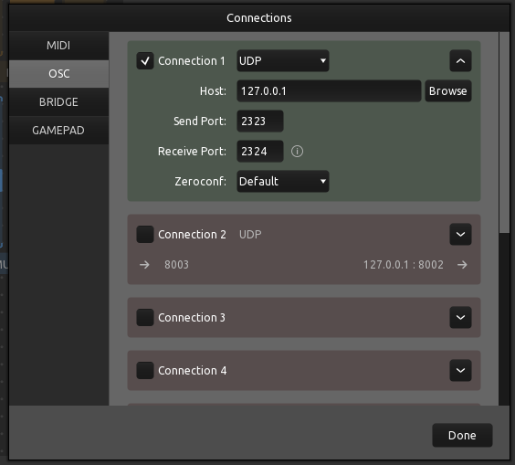
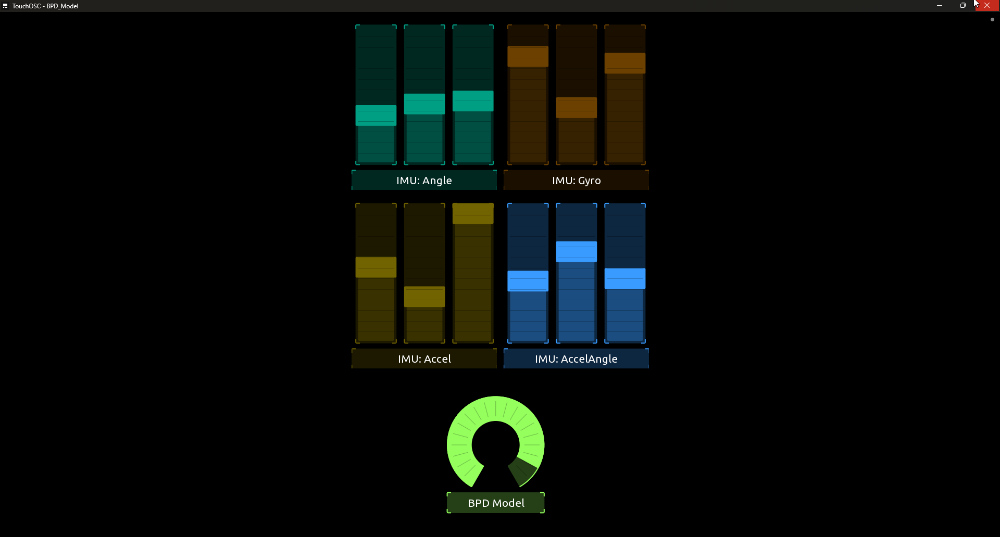

# Setting up

## Visual Studio Code
- Install Python. This has been tested with Python 3.8
- Install visual studio code
- Install the python extension in visual studio code

### Creating a virtual environment for python
In visual studio code, press ```CTRL+SHIFT+P``` to show all commands. Select ```Python: Create Environment```. Select the python interpreter that you have installed

### Intalling libraries
Open a new terminal (either ```CTRL+SHIFT+\` ``` or from the menu: Terminal->New Terminal). Double check that the command prompt in your terminal starts with ```(.venv)``` - this indicates that you are running the newly created virtual environment

Then, execute:
```bash
$ python -m pip install python-osc
$ python -m pip install keyboard
$ python -m pip install Timeloop
$ python -m pip install numpy
$ python -m pip install matplotlib
$ python -m pip install pyo
$ python -m pip install wxpython
```

Or, all at once:
```bash
 $ python -m pip install python-osc keyboard Timeloop numpy matplotlib pyo
```

## TouchOSC

- Install [TouchOSC](https://hexler.net/touchosc)
- Open the file [BPD_Model.tosc](./BPD_Model.tosc)
- Press the chain link icon in the toolbar in the top of the window
- Configure the connections as seen in the image below<br>
[](./Media/touchosc_connections.png) 
- Press the play icon in the toolbar in the top of the window
- You should see something similar to the image below<br>
[](./Media/touchosc_play.png) 
- The 4 sets of faders represent the IMU data received (in OSC messages) from the arduino
- The knob represents the BPD Model data received from the python script

# Running the python script

The python script is [main.py](./main.py). This script provides a skeletal implementation with the following:

- placeholder code for running a bpd model
- placeholder code for receiving IMU OSC messages from the Arduino
- placeholder code for sending OSC messages with current bpd state

Start this script by entering the following command in the visual studio code terminal:

```powershell
$ python ./main.py
```

When you run the script, you should see the BPD Model knob update in TouchOSC, based on OSC information sent out by this python scrupt. Conversely, if you move any of the faders in TouchOSC, you should see the python script print a message to the console that OSC information has been received by this python script. 

Press and hold either ESC or Space to exit the script.

# How the python code works

## BPD model and treatment

The following code instantiates the BPD model and treatment to use. Here it is `BPDModel2` which is based on the `ProfessorModel` from the code that Vivek sent me. You can see how initial values are being provided when instantiating `BPDModel1` and `BPDTreatment1`. 

```python
# ------------------------------------------------------------------------------------------------------------
# The bpd model and treatment logic
from BPDModel2 import BPDModel2
from BPDTreatment1 import BPDTreatment1

# Instantiate the bpd model and treatment logic to use
_modelUpdateInterval:float = 0.0015
_modelToUse:BPDModel2 = BPDModel2(dt=_modelUpdateInterval, delay_seconds=0.02, g_gain=0.07, lamb=0.5)
_treatmentToUse:BPDTreatment1 = BPDTreatment1(XAngleRatio=0.5, XAngleVelocityRatio=0.0, TreatmentScale=0.001)

```
The value of the global variable `_modelUpdateInterval` shown above determines how often the model code is run in python, as well as the `dt` parameter with which the model formula update themselves.

Below is the python code that 'glues' the bpd model, treatment, arduino IMU data handling, and graph plotting code together:

```python
# ------------------------------------------------------------------------------------------------------------
@_timeLoop.job(interval=timedelta(seconds=_modelUpdateInterval))
def updateBPDModel():
    global _modelToUse
    global _imuData
    _modelToUse.step(_treatmentToUse.CalculateTreatmentEffect(_imuData), DT=_modelUpdateInterval)
    _plottingQueue.put(_modelToUse.ModelState)

```

The code that sends / receives OSC messages runs separately. OSC messages are sent periodically (at a slower rate than the model update code)

```python
# ------------------------------------------------------------------------------------------------------------
@_timeLoop.job(interval=timedelta(seconds=_oscSendInterval))
def sendOscMessages():
    global _oscClient
    global _modelToUse
    _oscClient.send_message("/Brandeis/BPD/Model", [_modelToUse.ModelState.BpdMood, _modelToUse.ModelState.BpdTreatmentEffect])
    print(f"Sent OSC: {time.ctime()}, BPD model mood: {_modelToUse.ModelState.BpdMood}, Treatment model effect: {_modelToUse.ModelState.BpdTreatmentEffect}")

```

## Tracking IMU state 

The following methods are in place for receiving OSC messages (sent by the Arduino) with different types of IMU data. What the code does is place the incoming data into a global `state variable` called `_imuData`. This global variable exposes properties to hold any type of data that the IMU provides (i.e., angle, gyro, temperature, etc). The 'glue code' mentioned above, just passes this global state variable to the code that updates the model, or calculates the treatment effect(s).

```python
# ------------------------------------------------------------------------------------------------------------
def handleOscMessage_Angle(address, *args):
    global _imuData
    global _debugLogIncomingOSC
    _imuData.xAngle = args[0]
    _imuData.yAngle = args[1]
    _imuData.zAngle = args[2]
    if _debugLogIncomingOSC:
        print(f"Received OSC: {address}: {args}")

# ------------------------------------------------------------------------------------------------------------
def handleOscMessage_Gyro(address, *args):
    global _imuData
    global _debugLogIncomingOSC
    _imuData.xGyro = args[0]
    _imuData.yGyro = args[1]
    _imuData.zGyro = args[2]
    if _debugLogIncomingOSC:
        print(f"Received OSC: {address}: {args}")

# ------------------------------------------------------------------------------------------------------------
def handleOscMessage_Accel(address, *args):
    global _imuData
    global _debugLogIncomingOSC
    _imuData.xAccel = args[0]
    _imuData.yAccel = args[1]
    _imuData.zAccel= args[2]
    if _debugLogIncomingOSC:
        print(f"Received OSC: {address}: {args}")

# ------------------------------------------------------------------------------------------------------------
def handleOscMessage_AccelAngle(address, *args):
    global _imuData
    global _debugLogIncomingOSC
    _imuData.xAccelAngle = args[0]
    _imuData.yAccelAngle = args[1]
    _imuData.zAccelAngle= args[2]
    if _debugLogIncomingOSC:
        print(f"Received OSC: {address}: {args}")

# ------------------------------------------------------------------------------------------------------------
def handleOscMessage_Temp(address, *args):
    global _imuData
    global _debugLogIncomingOSC
    _imuData.temp = args[0]
    if _debugLogIncomingOSC:
        print(f"Received OSC: {address}: {args}")
```

```
Note: the IMU's temperature data is represented in the global state variable , but at this point not visualized in TouchOSC
```

# Modifying code

## BPD Model

Two example BPD model implementations are currently provided: [BPDModel1.py](./BPDModel1.py) and [BPDModel2.py](./BPDModel2.py). You can create additional implementations (i.e., `BPDModel3.py`, `BPDModel4.py` and so on) as needed using this as a template. 

All model code uses the base class `AbstractModel` (see [Helpers\AbstractModel.py](./Helpers/AbstractModel.py) for an example of how this base class is implemented). Your additional model code at minimum must implement a single abstract method, which updates the state of the model based on the current treatment effect and a time step. Optionally, your model can handle key presses (i.e. to change a model parameter at runtime):

```python
    # --------------------------
    # Abstract method to update the model state
    # --------------------------
    @abstractmethod
    def step(self, treatmentEffect:float, DT:float=0.04):
        pass

    # --------------------------
    # Method to handle key press
    # --------------------------
    def on_key(self, event):
        pass
```

As you can see in the two existing model implementations, you can add as many additional methods as needed, but this is the one that must be implemented

The `AbstractTreatment` base class is similar, it defines two main functions that you can override to implement different mappings of IMU data to treatment effect:

```python
   # ------------------------------------------------------------------------------------------------------------
   # Abstract method to calculate treatment effect based on IMU state data
   @abstractmethod
   def CalculateTreatmentEffect(self, imuData:ImuData)->float :
      pass

   # ------------------------------------------------------------------------------------------------------------
   # Method to handle keypress
   def on_key(self, event):
      pass

```
See [BPDTreatment1.py](./BPDTreatment1.py) for an example implementation

## BPD Treatment

