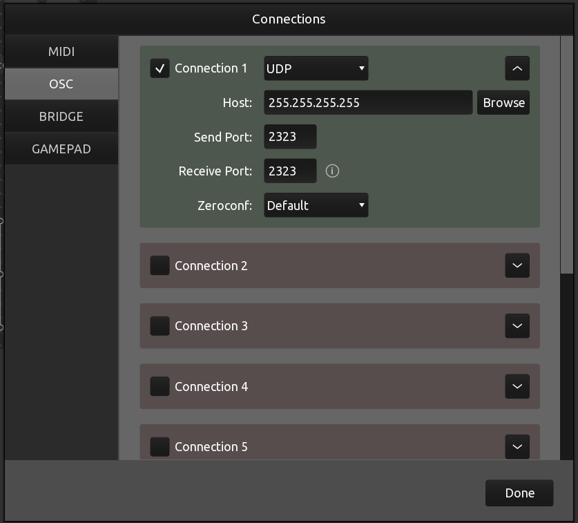

# Setting up

## Visual Studio Code
- Install visual studio code
- Install Pyton. This has been tested with Python 3.8

### Creating a virtual environment for python
In visual studio code, press ```CTRL+SHIFT+P``` to show all commands. Select ```Python: Create Environment```. Select the python interpreter that you have installed

### Intalling libraries
Open a new terminal (either ```CTRL+SHIFT+\` ``` or from the menu: Terminal->New Terminal). Double check that the command prompt in your terminal starts with ```(.venv)``` - this indicates that you are running the newly created virtual environment

Then, execute:
```bash
$ python -m pip install python-osc
$ python -m pip install keyboard
$ python -m pip install Timeloop
```

## TouchOSC

- Install [TouchOSC](https://hexler.net/touchosc)
- Open the file [BPD_Model.tosc](./BPD_Model.tosc)
- Press the chain link icon in the toolbar in the top of the window
- Configure the connections as seen in the image below<br>
[](./Media/touchosc_connections.png) 
- Press the play icon in the toolbar in the top of the window
- You should see something similar to the image below<br>
[](./Media/touchosc_play.png) 
- The 4 sets of faders represent the IMU data received (in OSC messages) from the arduino
- The knob represents the BPD Model data received from the python script

```
Note: For now, only the BPD Model value is in the correct range [-1, 1]. The IMU data that is simulated by moving the faders is in the range [0, 1]. This will likely change in future iterations on the codebase.
```

# Running the pyton script

The python script is [main.py](./main.py). This script provides a skeletal implementation with the following:

- placeholder code for running a bpd model
- placeholder code for receiving IMU OSC messages from the Arduino
- placeholder code for sending OSC messages with current bpd state

Start this script by entering the following command in the visual studio code terminal:

```powershell
$ python ./main.py
```

When you run the script, you should see the BPD Model knob update in TouchOSC, based on OSC information sent out by this python scrupt. Conversely, if you move any of the faders in TouchOSC, you should see the python script print a message to the console that OSC information has been received by this python script. 

Press and hold either ESC or Space to exit the script.

# Modifying python code

## Modifying placeholder code: BPD model

Find and modify the following method to run the BPD model. The model's output, a value in the range [-1, 1] capturing the current mental state, should be written to `_modelOutputData.BpdValue`. In the placeholder code below, a random value is written.

```python
# ------------------------------------------------------------------------------------------------------------
@_timeLoop.job(interval=timedelta(seconds=0.1))
def updateBPDModel():
    global _modelOutputData
    _modelOutputData.BpdValue = random.uniform(-1,1)
```

## Modifying placeholder code: Mapping IMU OSC parameters 

The following methods have placeholder code that is called whenever IMU data is received via OSC. For now, this placeholder code only prints the message contents to screen. Change this code as needed to grab whatever the parameters of interest are, and store them in a global variable. The `updateBPDModel()` method can then refer to those global variables, and inject them into the model the next time that the model is updated.

```python
# ------------------------------------------------------------------------------------------------------------
def handleOscMessage_Angle(address, *args):
    print(f"{address}: {args}")

# ------------------------------------------------------------------------------------------------------------
def handleOscMessage_Gyro(address, *args):
    print(f"{address}: {args}")

# ------------------------------------------------------------------------------------------------------------
def handleOscMessage_Accel(address, *args):
    print(f"{address}: {args}")

# ------------------------------------------------------------------------------------------------------------
def handleOscMessage_AccelAngle(address, *args):
    print(f"{address}: {args}")

# ------------------------------------------------------------------------------------------------------------
def handleOscMessage_AccelTemp(address, *args):
    print(f"{address}: {args}")
```

```
Note: the IMU's temperature data is received by this python script, but at this point not represented in TouchOSC
```